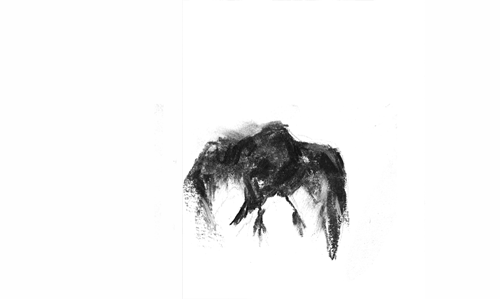

<!-- ============================================================ -->
<!--                          BANNER                             -->
<!-- ============================================================ -->

 

---

<!-- ============================================================ -->
<!--                       KNOW ABOUT ME                         -->
<!--   Text-only, full-width -> flawless on desktop AND mobile.  -->
<!--   The banner already carries the character/branding.        -->
<!-- ============================================================ -->

## Sobre Mim

 

Sou um estudante de desenvolvimento que entrou nessa área por uma vontade muito simples: transformar ideias em coisas que realmente funcionam. O que começou como curiosidade por tecnologia acabou se tornando uma paixão por desenvolvimento Frontend, interfaces e pela experiência que existe por trás de cada produto digital.

A maioria das coisas que construo começa da mesma forma: vejo algo que poderia ser melhor, mais bonito ou mais fácil de usar e começo a pensar em como eu faria. Algumas horas depois, existe uma nova interface, um projeto ou uma solução sendo construída. Gosto de entender não apenas como algo funciona por trás do código, mas também como as pessoas interagem com aquilo.

Meu foco está em desenvolvimento Frontend, UI/UX e na criação de experiências digitais modernas, funcionais e intuitivas. Ainda estou no começo da jornada, aprendendo, testando, quebrando coisas de propósito e reconstruindo para entender melhor como tudo funciona.

 

---

<!-- ============================================================ -->
<!--                        TECH STACK                           -->
<!--        Monochrome shields badges (black + white logo)       -->
<!-- ============================================================ -->

## Tech Stack

 

**Languages & Frameworks**

 

**Tools & Platforms**

 

---

<!-- ============================================================ -->
<!--                         PROJECTS                            -->
<!-- ============================================================ -->

<!-- ============================================================ -->
<!--                       GITHUB STATS                          -->
<!--                                                             -->
<!--  IMPORTANT: the two cards below use the PUBLIC instance     -->
<!--  (github-readme-stats.vercel.app), which is often rate-     -->
<!--  limited and shows a broken image. To make them reliable,   -->
<!--  deploy your own free instance and replace the domain       -->
<!--  "github-readme-stats.vercel.app" with your own, e.g.       -->
<!--  "adeel-stats.vercel.app". Steps are in the chat message.   -->
<!-- ============================================================ -->

## GitHub Stats

 

 
 

 

---

<!-- ============================================================ -->
<!--                    CONTRIBUTION GRAPH                        -->
<!-- ============================================================ -->

## Contribution Graph

 

 
 

 

---

<!-- ============================================================ -->
<!--                       LET'S CONNECT                         -->
<!-- ============================================================ -->

## Let's Connect

 

 
 

<i>Building in public, one commit at a time.</i>

 

