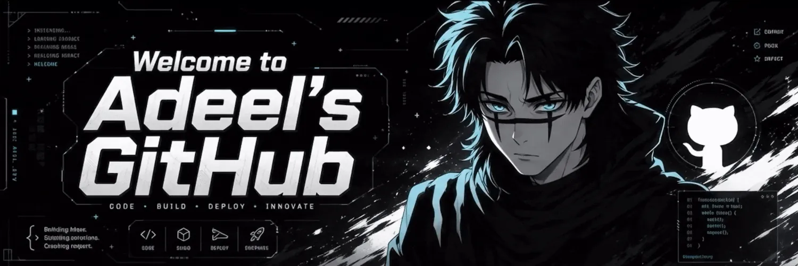

<!-- ============================================================ -->
<!--                          BANNER                             -->
<!-- ============================================================ -->

 

---

<!-- ============================================================ -->
<!--                       KNOW ABOUT ME                         -->
<!--   Text-only, full-width -> flawless on desktop AND mobile.  -->
<!--   The banner already carries the character/branding.        -->
<!-- ============================================================ -->

## Know About Me

 

I'm an AI student who got into this field for a very honest reason. I wanted to build things that handle the boring work so I don't have to. That slowly turned into a real obsession with AI agents, automation, and the backend systems that quietly hold everything together.
Most of what I build starts the same way: I get mildly annoyed at doing something by hand, and a few hours later there's a Python script, an agent, or an LLM pipeline doing it better than I would have. I care less about the hype and more about tools that actually work when you run them.
Still early in the journey, still breaking things on purpose to understand them.

 

---

<!-- ============================================================ -->
<!--                        TECH STACK                           -->
<!--        Monochrome shields badges (black + white logo)       -->
<!-- ============================================================ -->

## Tech Stack

 

**Languages & Frameworks**

 

**Tools & Platforms**

 

---

<!-- ============================================================ -->
<!--                         PROJECTS                            -->
<!-- ============================================================ -->

## Projects

 

### Token Efficient Routing Agent

> An AI agent system that routes tasks intelligently to cut unnecessary model calls — keeping cost and latency down without sacrificing output quality.

**Focus:** AI agent workflows · LLM optimization · prompt engineering · Python

  

### E-commerce Customer Support Automation

> An automated n8n triage system using Groq AI (Llama 3.3) to classify support emails, draft replies, log analytics to Google Sheets, and flag urgent escalations.

**Focus:** n8n · AI Automation · Groq API · Customer Support · Gmail & Sheets API

  

More projects are on the way — check my pinned repositories.

 

---

<!-- ============================================================ -->
<!--                       GITHUB STATS                          -->
<!--                                                             -->
<!--  IMPORTANT: the two cards below use the PUBLIC instance     -->
<!--  (github-readme-stats.vercel.app), which is often rate-     -->
<!--  limited and shows a broken image. To make them reliable,   -->
<!--  deploy your own free instance and replace the domain       -->
<!--  "github-readme-stats.vercel.app" with your own, e.g.       -->
<!--  "adeel-stats.vercel.app". Steps are in the chat message.   -->
<!-- ============================================================ -->

## GitHub Stats

 

 
 

 

---

<!-- ============================================================ -->
<!--                    CONTRIBUTION GRAPH                        -->
<!-- ============================================================ -->

## Contribution Graph

 

 
 

 

---

<!-- ============================================================ -->
<!--                       LET'S CONNECT                         -->
<!-- ============================================================ -->

## Let's Connect

 

 
 

<i>Building in public, one commit at a time.</i>

 

